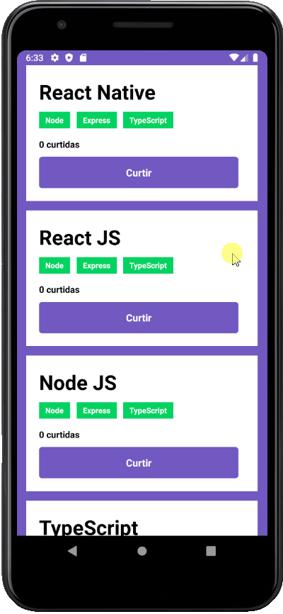

<h1 align="center">
  <a href="https://github.com/csorlandi/nodejs-concepts">
    
  </a>
</h1>

<p align="center">
  <a href="#execution">Preview</a>&nbsp;&nbsp;&nbsp;|&nbsp;&nbsp;&nbsp;  
  <a href="#technologies">Technologies Used</a>&nbsp;&nbsp;&nbsp;|&nbsp;&nbsp;&nbsp;
  <a href="#run">How to run the project</a>&nbsp;&nbsp;&nbsp;|&nbsp;&nbsp;&nbsp;
  <a href="#contribute">How to contribute</a>&nbsp;&nbsp;&nbsp;|&nbsp;&nbsp;&nbsp;
  <a href="#license">License</a>
</p>

<p align="center">
  

  

  
</p>

<br>

## :books: About

Mobile [challenge](https://github.com/rocketseat-education/bootcamp-gostack-desafios/tree/master/desafio-conceitos-reactjs) to improve the React Native concepts applied in Rocketseat's GoStack Bootcamp.

 it's an Application which stores repositories of the a portfolio. it enables one to read and liked repositories.

<a id="execution"></a><br>

 ## :tv: Preview




<a id="technologies"></a><br>

## ⚒️ Technologies Used
  * React Native
  

<a id="run"></a><br>

## 🚀 How to run the project on the Android emulator

- [Configure](https://react-native.rocketseat.dev/android/windows) the emulator to run the project

<br>

- Clone the repository of the [API](https://github.com/RuthMaria/gostack-nodeJs-concepts) and run

<br>

- Clone this repository

```
git clone https://github.com/RuthMaria/gostack-reactNative-concepts.git
```

- Install dependencies

```
yarn 
```

- Define the connection port with the emulator

```
adb reverse tcp:3333 tcp:3333
```

- Run the project

```
yarn Android
```

- Run the tests

```
yarn test
```

<br>

## 🎯 How to contribute

- Fork this repository,
- Create a branch with your feature: `git checkout -b my-feature`
- Commit your changes: `git commit -m 'feat: My new feature'`
- Push your branch: `git push origin my-feature`

<a id="license"></a><br>

## :memo: License

This project is under the MIT license. See the  file [LICENSE](LICENSE) for more details.

---

<h4 align="center">
    Developed with ❤️ by <a href="https://www.linkedin.com/in/ruth-maria-9b256071/" target="_blank">Ruth Maria</a>
</h4>
